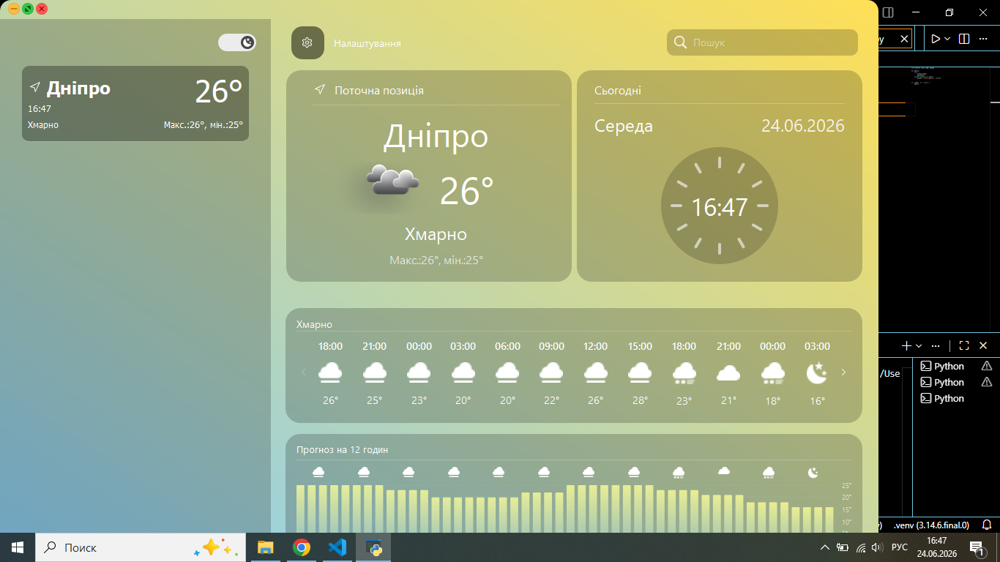
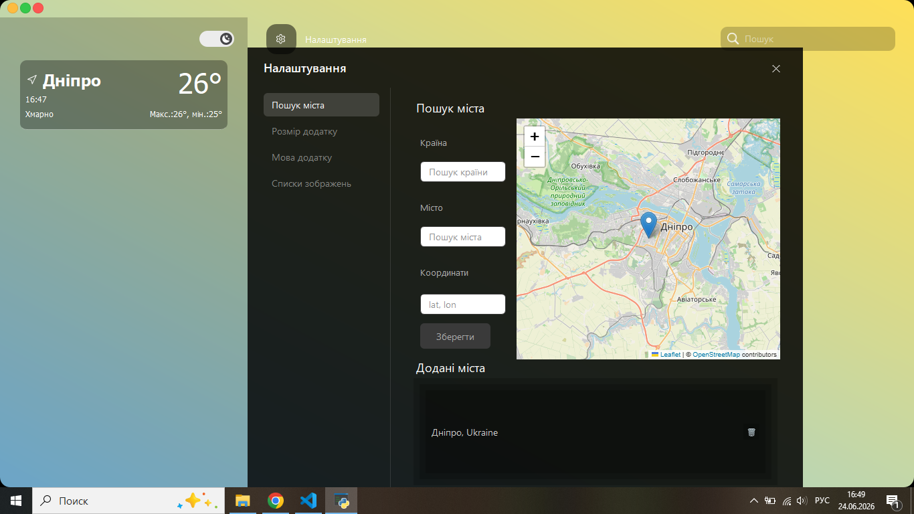
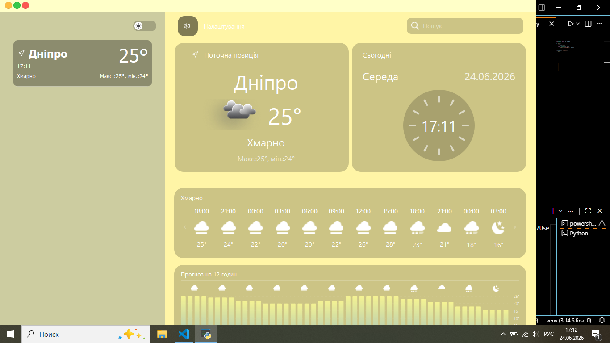

<div align="center">

# 🌦️ Weather Project

**Десктопний застосунок погоди на PyQt6 з адаптивним інтерфейсом, темною/світлою темою та підтримкою кількох мов**

[Українська](#-українська) • [English](#-english)

</div>

---

## 🇺🇦 Українська

### 1. Мета створення проєкту

Проєкт створений як навчальна desktop-програма для відображення поточної погоди та прогнозу по містах світу. Він буде корисний початківцю, тому що на його прикладі можна побачити:

- як будувати **модульну архітектуру** Python-застосунку (розділення на `window`, `card`, `settings`);
- як працювати з **GUI-фреймворком PyQt6** (кастомні безрамкові вікна, власні віджети, QSS-стилізація);
- як інтегрувати **зовнішнє REST API** (OpenWeather) та кешувати відповіді;
- як реалізувати **локалізацію** інтерфейсу на кілька мов;
- як організувати **збереження користувацьких даних** (обрані міста) у JSON-файлах.

### 2. Склад команди

| Учасник | GitHub |
|---|---|
| _Саша stelc_ | [https://github.com/sasha-stelc/Weather-Project.git](https://github.com/sasha-stelc/Weather-Project.git) |
| _Кирило Давидушкін_ | [https://github.com/KirillDavydushkin](https://github.com/USERNAME) |
| _Паша Банцер_ | [https://github.com/PashaBantser/igruha](https://github.com/PashaBantser/igruha) |


### 3. Зміст файлу

- [1. Мета створення проєкту](#1-мета-створення-проєкту)
- [2. Склад команди](#2-склад-команди)
- [3. Зміст файлу](#3-зміст-файлу)
- [4. Перелік модулів та технологій](#4-перелік-модулів-та-технологій)
- [5. Як запустити проєкт у роботу](#5-як-запустити-проєкт-у-роботу)
- [6. Зміст проєкту](#6-зміст-проєкту)
- [7. Висновок по роботі](#7-висновок-по-роботі)

### 4. Перелік модулів та технологій

**Мова та середовище**
- Python 3.13+

**Технології та бібліотеки**
| Бібліотека | Призначення |
|---|---|
| `PyQt6` | побудова графічного інтерфейсу (вікна, віджети, сигнали) |
| `PyQt6-WebEngine` | вбудоване відображення інтерактивної карти міста |
| `requests` | HTTP-запити до OpenWeather API |
| `folium` | генерація інтерактивної карти (HTML/Leaflet) для вибору міста |

> ℹ️ `PyQt6-WebEngine` та `folium` використовуються модулем пошуку міста на карті (`modules/settings/search_sity.py`), але відсутні у `requirements.txt` — додайте їх вручну, якщо плануєте користуватись цією функцією (див. розділ 5).

**Структура модулів проєкту**
```
Weather-Project/
├── main.py                     # точка входу в застосунок
├── requirements.txt
├── media/                      # іконки погоди, кнопки, графічні ресурси
└── modules/
    ├── app.py                  # ініціалізація QApplication
    ├── window.py                # створення головного вікна
    ├── api_request.py           # запити до OpenWeather API, кешування
    ├── create_path.py            # допоміжні функції шляхів до медіа
    ├── styles.py                 # QSS-стилі застосунку
    ├── title_bar.py              # кастомна панель заголовка вікна
    ├── window/                   # компонування головного вікна
    │   ├── weather_app.py         # головне вікно застосунку
    │   ├── left_panel.py          # бокова панель зі списком міст
    │   ├── right_panel.py         # панель з детальною погодою
    │   ├── search_panel.py        # пошук та додавання міста
    │   ├── settings_panel.py      # панель налаштувань
    │   └── theme_switch.py        # перемикач теми (день/ніч)
    ├── card/                     # віджети карток погоди
    │   ├── weather_card.py         # картка міста у списку
    │   ├── city_info_frame.py      # інформація про обране місто
    │   ├── hourly_forecast_frame.py # почасовий прогноз
    │   ├── twelve_hour_graph_frame.py # графік температури на 12 год
    │   └── clock_face_widget.py    # віджет циферблата годинника
    └── settings/                  # налаштування застосунку
        ├── settings.py             # логіка панелі налаштувань
        ├── search_sity.py          # пошук міста на інтерактивній карті
        ├── langueges.py            # система локалізації (uk/ru/en/no)
        ├── size_config.py          # конфігурація розмірів елементів
        ├── application_size.py     # налаштування розміру вікна
        └── images.py                # завантаження графічних ресурсів
```

### 5. Як запустити проєкт у роботу

1. **Клонуйте репозиторій**
   ```bash
   git clone https://github.com/sasha-stelc/Weather-Project.git
   cd Weather-Project
   ```

2. **Створіть та активуйте віртуальне середовище** *(рекомендовано)*
   ```bash
   python -m venv venv
   # Windows
   venv\Scripts\activate
   # macOS / Linux
   source venv/bin/activate
   ```

3. **Встановіть залежності**
   ```bash
   pip install -r requirements.txt
   pip install PyQt6-WebEngine folium
   ```

4. **(Необов'язково) Вкажіть власний API-ключ OpenWeather**

   У застосунку вже є тестовий ключ, але для стабільної роботи рекомендується отримати власний безкоштовний ключ на [openweathermap.org](https://openweathermap.org/api) та задати його через змінну середовища:
   ```bash
   # Windows (PowerShell)
   $env:OPENWEATHER_API_KEY="ваш_ключ"
   # macOS / Linux
   export OPENWEATHER_API_KEY="ваш_ключ"
   ```

5. **Запустіть застосунок**
   ```bash
   python main.py
   ```

### 6. Зміст проєкту

Застосунок складається з кількох взаємопов'язаних додатків (модулів), кожен з яких відповідає за окрему частину інтерфейсу:

- **Головне вікно (`WeatherApp`)** — безрамкове вікно застосунку, що об'єднує всі панелі та керує загальним станом (поточне обране місто, тема, мова).
- **Бокова панель (`LeftPanel`)** — список збережених міст користувача у вигляді карток (`WeatherCard`) з можливістю вибору активного міста та перемикання теми день/ніч.
- **Панель деталей (`RightPanel`)** — детальна інформація про обране місто: поточна погода, почасовий прогноз (`HourlyForecastFrame`), графік температури (`TwelveHourGraphFrame`) та аналоговий годинник (`ClockFaceWidget`) з урахуванням часового поясу міста.
- **Панель пошуку (`SearchPanel`)** — текстовий пошук міста за назвою з автодоповненням та додаванням до списку обраних.
- **Панель налаштувань (`SettingsPanel` / `Settings`)** — зміна мови інтерфейсу (українська, російська, англійська, норвезька), розміру вікна та пошук міста через інтерактивну карту (`folium` + `QWebEngineView`).
- **Модуль API-запитів (`api_request.py`)** — взаємодія з OpenWeather API, кешування відповідей (TTL 5 хвилин) та зберігання списку обраних міст у `user_cities.json`.
- **Кастомна панель заголовка (`TitleBar`)** — власна реалізація системних кнопок (закрити/згорнути/розгорнути) та перетягування вікна.

**Скриншоти інтерфейсу:**


```



```

### 7. Висновок по роботі

Під час роботи над проєктом ми отримали практичний досвід побудови повноцінного desktop-застосунку на Python з нуля. Зокрема, ми навчились:

- проєктувати **модульну архітектуру** великого GUI-застосунку, розділяючи відповідальність між компонентами;
- працювати з **PyQt6**: створювати кастомні віджети, безрамкові вікна, обробляти сигнали та події;
- інтегрувати **зовнішні API** та керувати кешуванням даних для зменшення кількості запитів;
- реалізовувати **багатомовність (i18n)** інтерфейсу через систему сигналів;
- стилізувати застосунок за допомогою **QSS** для створення сучасного вигляду з підтримкою тем.

**Подальший розвиток проєкту:**
- додавання тижневого прогнозу погоди;
- винесення API-ключа та конфігурації у `.env`-файл;
- покриття коду unit-тестами;
- додавання сповіщень про різкі зміни погоди;
- публікація застосунку у вигляді виконуваного файлу (`.exe` / `.app`) через PyInstaller.

<br>

---

## 🇬🇧 English

### 1. Project purpose

This project is a learning-oriented desktop application that displays current weather and forecasts for cities worldwide. It is useful for beginners because it demonstrates:

- how to design a **modular architecture** for a Python application (separating `window`, `card`, and `settings` layers);
- how to work with the **PyQt6 GUI framework** (custom frameless windows, custom widgets, QSS styling);
- how to integrate an **external REST API** (OpenWeather) and cache its responses;
- how to implement **multi-language localization** in a desktop UI;
- how to organize **persistent user data** (favorite cities) using JSON files.

### 2. Team

| Member | GitHub |
|---|---|
| _sasha stelc_ | [https://github.com/sasha-stelc/Weather-Project.git](https://github.com/sasha-stelc/Weather-Project.git) |
| _Pasha Bantser_ | [https://github.com/PashaBantser/igruha](https://github.com/PashaBantser/igruha) |
| _ Kyrylo Davydushkin_ | [https://github.com/KirillDavydushkin](https://github.com/KirillDavydushkin) |

> ✏️ *Fill in the table with the real names and GitHub links of the team members.*

### 3. Table of contents

- [1. Project purpose](#1-project-purpose)
- [2. Team](#2-team)
- [3. Table of contents](#3-table-of-contents)
- [4. Modules and technologies](#4-modules-and-technologies)
- [5. How to run the project](#5-how-to-run-the-project)
- [6. Project contents](#6-project-contents)
- [7. Conclusion](#7-conclusion)

### 4. Modules and technologies

**Language & runtime**
- Python 3.13+

**Libraries**
| Library | Purpose |
|---|---|
| `PyQt6` | building the graphical interface (windows, widgets, signals) |
| `PyQt6-WebEngine` | embedded interactive map of the selected city |
| `requests` | HTTP requests to the OpenWeather API |
| `folium` | generating an interactive map (HTML/Leaflet) for city selection |


**Project module structure**
```
Weather-Project/
├── main.py                     # application entry point
├── requirements.txt
├── media/                      # weather icons, buttons, graphic assets
└── modules/
    ├── app.py                  # QApplication initialization
    ├── window.py                # main window creation
    ├── api_request.py           # OpenWeather API requests, caching
    ├── create_path.py            # media path helper functions
    ├── styles.py                 # application QSS styles
    ├── title_bar.py              # custom window title bar
    ├── window/                   # main window layout
    │   ├── weather_app.py         # main application window
    │   ├── left_panel.py          # sidebar with the city list
    │   ├── right_panel.py         # detailed weather panel
    │   ├── search_panel.py        # city search and adding
    │   ├── settings_panel.py      # settings panel
    │   └── theme_switch.py        # light/dark theme switch
    ├── card/                     # weather card widgets
    │   ├── weather_card.py         # city card in the list
    │   ├── city_info_frame.py      # selected city info
    │   ├── hourly_forecast_frame.py # hourly forecast
    │   ├── twelve_hour_graph_frame.py # 12-hour temperature chart
    │   └── clock_face_widget.py    # analog clock widget
    └── settings/                  # application settings
        ├── settings.py             # settings panel logic
        ├── search_sity.py          # search a city on an interactive map
        ├── langueges.py            # localization system (uk/ru/en/no)
        ├── size_config.py          # UI element size configuration
        ├── application_size.py     # window size settings
        └── images.py                # graphic resource loading
```

### 5. How to run the project

1. **Clone the repository**
   ```bash
   git clone https://github.com/sasha-stelc/Weather-Project.git
   cd Weather-Project
   ```

2. **Create and activate a virtual environment** *(recommended)*
   ```bash
   python -m venv venv
   # Windows
   venv\Scripts\activate
   # macOS / Linux
   source venv/bin/activate
   ```

3. **Install dependencies**
   ```bash
   pip install -r requirements.txt
   pip install PyQt6-WebEngine folium
   ```

4. **(Optional) Set your own OpenWeather API key**

   The app ships with a test key, but for reliable usage it is recommended to get a free key from [openweathermap.org](https://openweathermap.org/api) and set it as an environment variable:
   ```bash
   # Windows (PowerShell)
   $env:OPENWEATHER_API_KEY="your_key"
   # macOS / Linux
   export OPENWEATHER_API_KEY="your_key"
   ```

5. **Run the application**
   ```bash
   python main.py
   ```

### 6. Project contents

The application consists of several interconnected sub-applications (modules), each responsible for a specific part of the UI:

- **Main window (`WeatherApp`)** — a frameless application window that combines all panels and manages the overall state (selected city, theme, language).
- **Sidebar (`LeftPanel`)** — a list of the user's saved cities as cards (`WeatherCard`), with the ability to select the active city and toggle the day/night theme.
- **Details panel (`RightPanel`)** — detailed information about the selected city: current weather, hourly forecast (`HourlyForecastFrame`), temperature chart (`TwelveHourGraphFrame`), and an analog clock (`ClockFaceWidget`) reflecting the city's time zone.
- **Search panel (`SearchPanel`)** — text-based city search with autocomplete and the ability to add cities to favorites.
- **Settings panel (`SettingsPanel` / `Settings`)** — interface language switching (Ukrainian, Russian, English, Norwegian), window size settings, and city search via an interactive map (`folium` + `QWebEngineView`).
- **API request module (`api_request.py`)** — communication with the OpenWeather API, response caching (5-minute TTL), and storing favorite cities in `user_cities.json`.
- **Custom title bar (`TitleBar`)** — a custom implementation of system buttons (close/minimize/maximize) and window dragging.

**Interface screenshots:**

> 🖼️ *Add screenshots of the main window, the settings panel, and the city search map here so users can visually evaluate the application's interface.*

```


```

### 7. Conclusion

Working on this project gave us practical experience building a full-featured desktop application in Python from scratch. In particular, we learned to:

- design a **modular architecture** for a large GUI application, separating responsibilities between components;
- work with **PyQt6**: creating custom widgets, frameless windows, and handling signals and events;
- integrate **external APIs** and manage data caching to reduce the number of requests;
- implement **multi-language (i18n)** support through a signal-based system;
- style an application using **QSS** to create a modern look with theme support.

**Further development:**
- adding a weekly weather forecast;
- moving the API key and configuration into a `.env` file;
- covering the codebase with unit tests;
- adding notifications for sudden weather changes;
- packaging the application as an executable (`.exe` / `.app`) via PyInstaller.